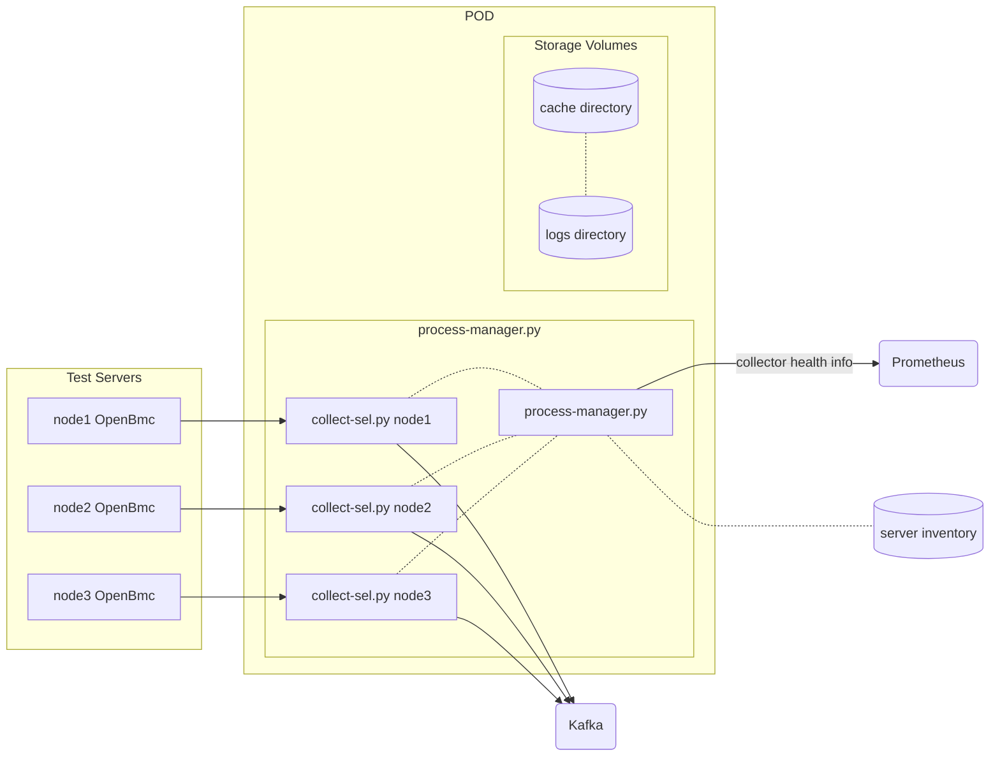

BMC Serial Event Log Collector
==============================

Deployment Instructions
-----------------------

Requirements (not included in this repo):
1. Server inventory file. For clusters with Openstack Ironic, there is a service that extracts the file from Ironic.
2. Kafka
3. Persistent storage (needed only for collector cache)
4. Helm3 client. Use helm3, because it does not require Tiller server.
 
### Server inventory

Server inventory is in a format that is supported by Prometheus servers.
```json
[
  {
    "targets": [
      "ironic--r02s02--10.219.28.52--ZGVidWd1c2Vy--MHBlbkJtYzE=",
      "ironic--r02s03--10.219.28.53--ZGVidWd1c2Vy--MHBlbkJtYzE=",
      "ironic--r02s10--10.219.28.60--ZGVidWd1c2Vy--MHBlbkJtYzE="
    ]
  }
]
```

Each line consists of fields separated by `--`. Fields description:
1. `ironic` - ironic instance name (not used by this collector)
2. `r02s02` - server name that will be submitted to Kafka and Logfiles
3. `10.219.28.52` - BMC address
4. `ZGVidWd1c2Vy` - base64 encoded BMC username
5. `MHBlbkJtYzE=` - base64 encoded BMC password

### Deployment

The service code and Dockerfile are located in a `code` directory.
Assuming that the Docker image is already uploaded to a Docker registry, use helm3 to deploy the collector.

Create `config.yaml` file with a cluster specific configuration. Use `whitley.yaml` as an example.

```
export NS=bmc-sel
cd deploy
kubectl create ns ${NS} || echo "namespace exists"
helm3 repo add stable https://kubernetes-charts.storage.googleapis.com/
helm3 upgrade --namespace ${NS} -i --debug "bmc-sel"
        --set image.repository="your-registry/sel-collector-location"
        --set image.tag="image-version"
        -f config.yaml ./helm-chart-bmc-sel-collector
```


Collector Architecture
----------------------

### Overview

The collector runs in a single Kubernetes POD. 
The POD entry point is a `process-manager.py`. This script watches the server inventory and spawns dedicated `collec-sel.py` processes for every monitored server.



### `collect-sel.py`
`collect-sel.py` that can be executed against one server: 

```
collect-sel.py --node r19s04 --bmc_ip r19b04.l10b2.deacluster.intel.com --username debuguser --password s3cr3t
```

The collector creates 2 files:

| file | description |
| ------ | ------ |
| `${LOG_PATH}/r19s04.log` | SEL events collected from `r19s04` server |
| `${CACHE_PATH}/r19s04.db` | Last event count and last event id on `r19s04` |

The collector also submits collected events to Kafka. It does that only if 2 environment variables are defined: `KAFKA_BROKERS` and `KAFKA_TOPIC`.

Preventing duplicate events
---------------------------

The collector uses `last event id` to prevent duplicate values. 
It stores this value in `${CACHE_PATH}/r19s04.db` file. 
On subsequent runs, the collector loads events from OpenBmc and searches for the `last event id` there. It will save only the events that were logged after the `last event id` value.

Unfortunately, OpenBMC fails on all following assumptions:
* event ids are unique
* time only goes forward
* events returned by redfish are in the order as they were logged
* when there are no new events, a redfish call for events will always return the same list in the same order
* the number of events can only increase or can reset to zero

It means that duplicate events may still appear.

Speed optimizations
-------------------

Redfish endpoint returns events in pages (max 1000 events per page).
Platforms usually have between 2K up tu 6K events. To improve collection peformance, the collector saves the `last event count` in the `{CACHE_PATH}/r19s04.db` file. 
On subsequent runs, the collector will query first for the event page with an offset `last event count - 100`. If it does not find the `last event id` in this page, it will perform full iteration.

